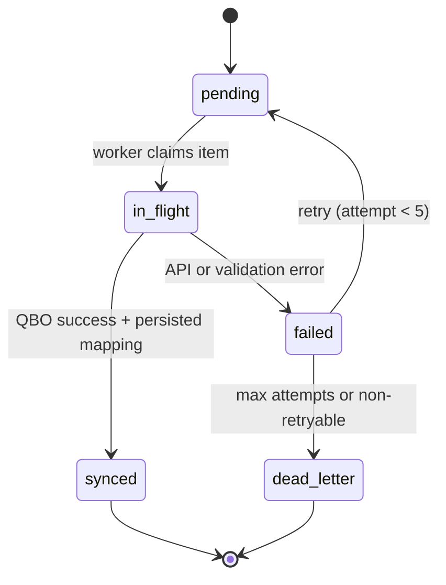
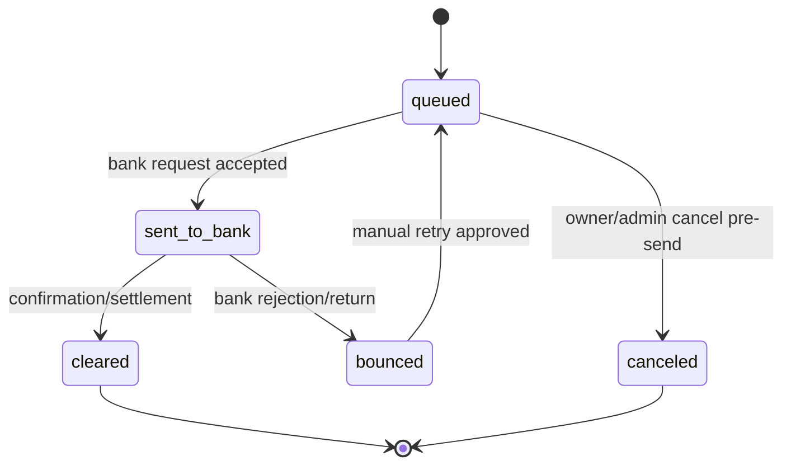
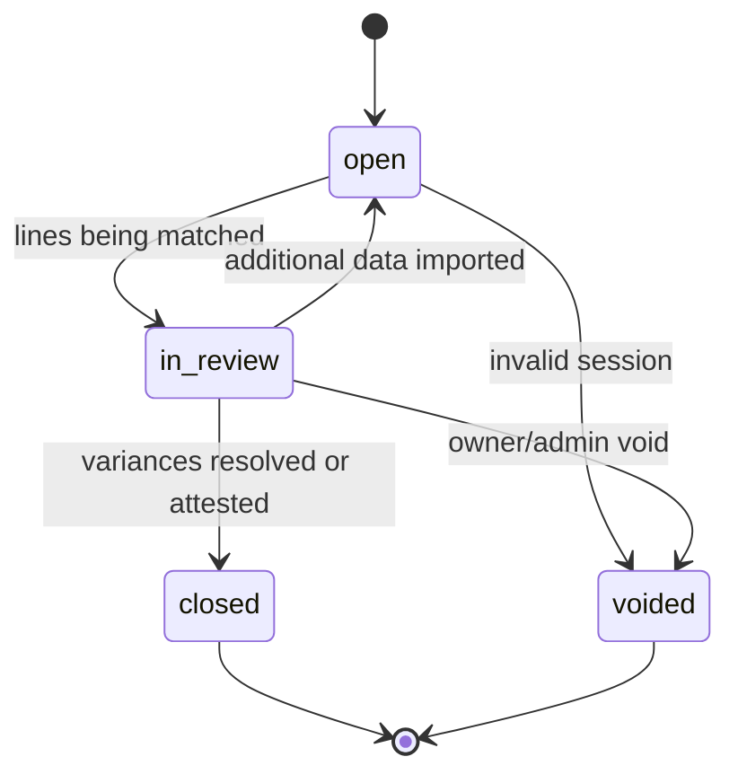
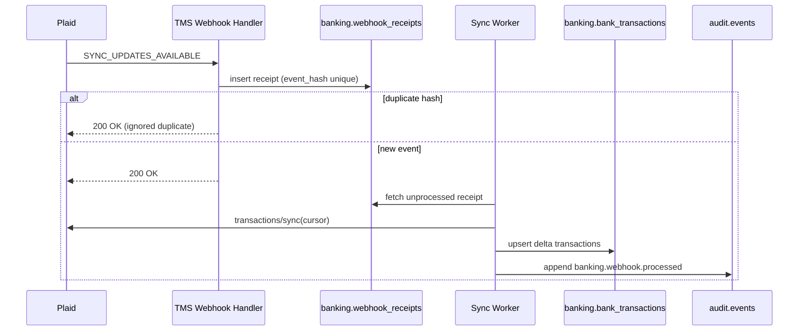
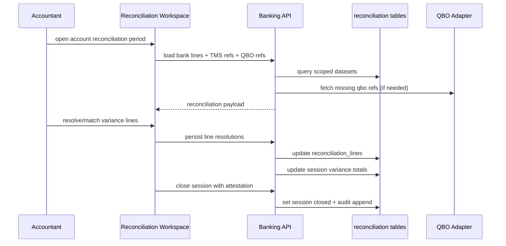

# PHASE 5 Banking + QBO Architecture (P5-SPEC-A)

Status: Draft for Jorge approval (Phase 5 entry gate)  
Owner: Jorge Munoz  
Prepared by: Cursor (spec-only block)  
Date: 2026-05-09  
Branch: `docs/p5-spec-a-banking-qbo-architecture`  
Scope: Architecture and delivery design only. No runtime code changes in this block.

---

## 1) Executive Summary

This document defines the Phase 5 architecture for:

1. Per-company QuickBooks Online (QBO) operating model.
2. Plaid-native banking ingestion and reconciliation under strict RLS.
3. QBO sync state machine and webhook-first incremental update flow.
4. Reconciliation workspace design (three-way match: bank <-> TMS <-> QBO).
5. Driver settlement auto-pay preview workflow.
6. TRK -> QBO migration runbook.
7. Backup and disaster recovery controls for Chapter 11 DIP operations.

This is an entry-gate spec. It provides design decisions, schema drafts, state machines, sequence diagrams, and open approvals required before Phase 5 implementation starts.

---

## 2) Pre-Flight Answers (Captured)

These were collected before spec authoring and are now treated as planning inputs:

1. USMCA at v1 launch operating: **No**
2. TRK QBO migration 4-6h read-only window: **This week** (exact slot pending)
3. Wells Fargo credentials / Plaid Link grant: **Yes**
4. Plaid Production approval: **Pending**
5. Faro factoring integration: **Manual daily Excel upload only**
6. CCG loan tracking: **Hybrid** (partial structure + manual JE)
7. Backup strategy: **Undecided** (must be finalized before implementation freeze)

Implication: Phase 5 must support production-safe banking architecture even if Plaid remains pending; implementation should run sandbox-first and include a contingency for delayed Plaid production activation.

---

## 3) Scope, Non-Goals, and Invariants

### 3.1 In Scope (This Spec)

- Per-company QBO realm strategy and recommendation.
- Banking schema and RLS architecture for Plaid ingestion.
- QBO sync queue/state machine and retry policy.
- Webhook processing model and event handling policy.
- Reconciliation workspace behavior and user flow.
- Settlement auto-pay state lifecycle and audit policy.
- TRK migration window planning and rollback controls.
- Backup/DR plan with RPO/RTO targets and fire-drill expectations.

### 3.2 Out of Scope (Deferred to Build Blocks)

- Actual implementation code (backend/frontend/migrations).
- Vendor-specific UI polish details outside workflow definition.
- Full Faro API integration (not available; manual upload remains source).
- Final CCG debt operational automation (stays hybrid until formal approval).

### 3.3 Locked Constraints Carried into Build

1. Plaid tokens encrypted at rest.
2. Every banking table scoped by `operating_company_id`.
3. Audit event on every banking read/write mutation path.
4. Void-not-delete for banking entities and reconciliation sessions.
5. No customer bank data or sensitive account details in logs.
6. Sandbox-first development, then production cutover after Plaid approval.
7. Backup restore test must pass before go-live.

---

## 4) Architectural Principles

### 4.1 Multi-Company Safety First

All banking and sync records carry `operating_company_id` as first-class partition key for RLS and operational isolation.

### 4.2 Evented Sync, Not Direct Coupling

QBO and Plaid interactions flow through queue-backed state machines (`pending -> in_flight -> terminal`), never through synchronous request/response in UI route handlers.

### 4.3 Deterministic Reconciliation

A transaction must be traceable across three ledgers:

- Bank source (Plaid or imported statement)
- TMS source event (load, bill, payment, settlement, transfer)
- QBO counterpart entry

Any break in chain surfaces as explicit variance; no silent drift.

### 4.4 Chapter 11 Auditability

Every state transition in sync, reconciliation, and settlement autopay emits append-only audit events with actor/service context.

### 4.5 Recovery by Design

RPO 1h and RTO 4h are architecture commitments, not operational afterthoughts.

---

## 5) Deliverable 1: Per-Company QBO Realm Architecture

## 5.1 Options

### Option A: Per-Company Realm

Each operating company (`IH35 Transportation`, `IH35 Trucking`, `USMCA`) gets a dedicated QBO realm.

### Option B: Shared Realm + Class Scoping

Single realm; operating companies separated by Class/Location conventions and strict posting templates.

## 5.2 Decision Matrix

| Criterion | Weight | Per-Realm | Shared+Class |
|---|---:|---:|---:|
| Data isolation confidence | 10 | 10 | 6 |
| Reconciliation complexity | 9 | 9 | 5 |
| Operational overhead | 7 | 5 | 9 |
| Migration simplicity (initial) | 7 | 6 | 8 |
| Error blast radius | 9 | 9 | 4 |
| Audit explainability | 8 | 9 | 6 |
| Long-term scaling clarity | 8 | 8 | 6 |
| Chapter 11 reporting clarity | 10 | 9 | 6 |
| Weighted total | - | **493** | **355** |

## 5.3 Recommendation

**Recommended: Per-Company QBO Realm (Option A)** with explicit realm-to-company mapping table in TMS.

Rationale:

1. Strongest legal and financial isolation.
2. Lower risk of cross-company posting drift.
3. Cleaner reconciliation per company.
4. Better blast-radius control for auth or token issues.
5. Better fit for eventual growth to additional operating entities.

## 5.4 Exception Rule

If business requires temporary shared-realm operation during migration week, enforce:

- Mandatory class mapping table.
- Sync-time validation guard that rejects unscoped postings.
- Daily drift report at class level.
- Hard deadline to split into per-realm configuration.

---

## 6) Deliverable 2: Plaid Banking Schema

This section proposes tables in `banking.*` with RLS and audit support.

## 6.1 Core Tables

1. `banking.bank_accounts`
2. `banking.bank_transactions`
3. `banking.transaction_categories`
4. `banking.reconciliation_sessions`

## 6.2 Table Intent

### `banking.bank_accounts`

- Stores account metadata linked to Plaid Item/account IDs.
- Holds source-of-truth mapping to operating company.
- Supports manual/offline account type for Faro virtual and non-Plaid accounts.

### `banking.bank_transactions`

- Ingests Plaid transactions keyed by `plaid_transaction_id`.
- Dedupes and retains immutable source payload hash.
- Supports correction/void flags, not hard delete.

### `banking.transaction_categories`

- Stores category inference and manual override.
- Tracks origin (`plaid_default`, `rule_engine`, `manual`).
- Supports confidence and reviewer metadata.

### `banking.reconciliation_sessions`

- Represents monthly or ad-hoc account reconciliation runs.
- Tracks workflow state, owner, and close checkpoints.

## 6.3 RLS Scoping Rules

For all banking tables:

- Include `operating_company_id uuid not null`.
- Policy uses `org.user_accessible_company_ids()` checks.
- Service jobs run under controlled bypass role only where needed.
- UI never receives rows outside active company scope.

## 6.4 Security Controls

1. Encrypt Plaid access tokens and processor tokens at rest.
2. Mask account/routing numbers in app logs.
3. Redact webhook payload fields with PII before logging.
4. Use immutable audit trail for token refresh attempts and failures.

---

## 7) Deliverable 3: QBO Sync State Machine

## 7.1 Queue Entity

`accounting.qbo_sync_queue` (existing/new extension) tracks every outbound or reconciliation sync task.

## 7.2 States

- `pending`
- `in_flight`
- `synced`
- `failed`
- `dead_letter` (optional terminal after retry exhaustion)

## 7.3 Transition Rules

1. `pending -> in_flight` when worker locks row.
2. `in_flight -> synced` on successful QBO response + persisted remote ID.
3. `in_flight -> failed` on transient or permanent error.
4. `failed -> pending` for retry-eligible errors and attempt `< 5`.
5. `failed -> dead_letter` at max attempts or non-retryable class.

## 7.4 Retry Policy

Exponential backoff:

- Attempt 1: 30s
- Attempt 2: 2m
- Attempt 3: 10m
- Attempt 4: 30m
- Attempt 5: 2h

Add jitter ±20% to reduce thundering herd.

## 7.5 Manual Re-Sync UI

For Owner/Admin:

- Filter by state, entity type, operating company.
- Inspect full error payload (sanitized).
- Trigger requeue action (`failed -> pending`) with audit reason.
- Bulk retry for selected rows.

## 7.6 Daily Drift Report Hook (Phase 6)

A scheduled job compares:

- TMS canonical totals by company/date/account
- QBO fetched balances by company/date/account
- Reconciliation unresolved variances

Emits:

- `reports.qbo_drift.daily_generated`
- Owner notification if thresholds exceeded.

---

## 8) Deliverable 4: Plaid Webhook Handler

## 8.1 Event Handling Contract

### `DEFAULT_UPDATE`

- Action: run incremental fetch for affected item/accounts.
- Store webhook receipt.
- Queue category refresh where needed.

### `INITIAL_UPDATE`

- Action: backfill up to 24 months per account.
- Mark account ingest state as `historical_backfill_complete` when done.

### `SYNC_UPDATES_AVAILABLE`

- Action: use Plaid transactions/sync cursor API for delta updates.
- Preserve idempotency using Plaid transaction IDs + webhook receipt IDs.

### `ERROR`

- Action: append critical audit event.
- Notify Owner immediately (email + in-app).
- Mark related account/item status as degraded.

### `WEBHOOK_UPDATE_ACKNOWLEDGED`

- Action: log informational audit event only.
- No downstream operation required.

## 8.2 Idempotency and Ordering

1. Persist webhook first (`webhook_receipts`) with unique event hash.
2. If duplicate event hash exists, no-op and return success.
3. Process async worker by event timestamp then created_at.
4. Reconcile out-of-order arrivals by cursor rules, not timestamp assumptions.

## 8.3 Failure Modes

- Temporary Plaid API outage -> retry with queue policy.
- Invalid access token -> token refresh path, then retry.
- Item revoked -> degrade account state, owner alert, manual relink required.

---

## 9) Deliverable 5: Reconciliation Workspace UI

## 9.1 Primary Route

`/banking/reconciliation/:account_id`

## 9.2 Core Panels

1. Session header (period, status, owner, account baseline balances)
2. Bank transaction panel (Plaid/imported statement lines)
3. TMS event panel (candidate operational entries)
4. QBO entry panel (mapped/posted records)
5. Variance queue
6. Resolution actions

## 9.3 Three-Way Match Strategy

Each reconciliation line stores:

- `bank_transaction_id`
- `tms_source_ref` (entity type + ID)
- `qbo_ref` (txn ID)
- amount/date/status deltas
- `match_quality` (`auto_exact`, `auto_fuzzy`, `manual`)

## 9.4 Statement Upload for Offline Accounts

Supports CSV/PDF ingestion for:

- Faro virtual account feed substitute
- Any institution unavailable in Plaid

Uploaded statements become normalized transaction rows flagged `source = statement_import`.

## 9.5 Variance Reporting

Outputs:

- Unmatched bank lines
- Unmatched QBO entries
- Amount/date variance buckets
- Cleared-vs-uncleared discrepancies

Exports:

- CSV variance report
- Session close attestation snapshot

## 9.6 UX Guardrails

1. Prevent close if unresolved critical variances exceed threshold.
2. Allow soft close with owner attestation + reason.
3. Require explicit reconciliation reason codes for manual matches.

---

## 10) Deliverable 6: Driver Settlement Auto-Pay (Phase 5E Preview)

## 10.1 Trigger

Settlement transitions to `final`.

## 10.2 Actions

1. Create QBO Bill Payment record (or queue for posting if delayed).
2. Queue bank payout request (ACH) through configured account rail.
3. Emit audit events for each transition.

## 10.3 State Model

- `queued`
- `sent_to_bank`
- `cleared`
- `bounced`
- `canceled` (pre-send only)

## 10.4 Operational Controls

1. Role-restricted manual retry for bounced payments.
2. Duplicate protection by settlement ID + payout fingerprint.
3. Auto-hold if driver compliance flags block payout.

## 10.5 Audit Events

- `driver_finance.autopay.queued`
- `driver_finance.autopay.sent_to_bank`
- `driver_finance.autopay.cleared`
- `driver_finance.autopay.bounced`
- `driver_finance.autopay.retry_requested`

---

## 11) Deliverable 7: TRK -> QBO Migration Plan

## 11.1 Pre-Migration Checklist

1. Export TRK account, vendor, customer, open AP/AR balances.
2. Freeze posting templates and category mappings.
3. Snapshot current reconciliation status per account.
4. Validate opening balances in staging realm.
5. Confirm migration comms sent to operations + accounting teams.

## 11.2 Read-Only Migration Window (4-6h)

Window target: **this week** (exact date/time pending Jorge confirmation).

During window:

- TRK QBO write operations disabled.
- TMS continues queueing sync intents in `pending` state.
- Controlled migration scripts execute in sequence.

## 11.3 Execution Sequence

1. Start read-only window.
2. Final delta export from TRK.
3. Import to target realm(s) with validation checkpoints.
4. Rebuild mapping tables (`external_id_map`).
5. Run post-import trial balance checks.
6. Enable TMS sync replay.
7. Monitor first replay batch closely.

## 11.4 Rollback Procedure

If any major validation fails:

1. Stop replay workers immediately.
2. Mark migration run failed with reason.
3. Re-enable TRK write mode.
4. Keep TMS intents queued; do not drop.
5. Publish incident note + revised migration window.

## 11.5 Post-Migration Validation Checklist

1. Company-by-company opening balances match expected tolerances.
2. AP/AR aging tie-out within tolerance threshold.
3. First 24h sync queue success rate > 98%.
4. No unresolved auth/token issues in realm bindings.
5. Reconciliation workspace shows no structural drift.

---

## 12) Deliverable 8: Backup + DR Strategy (Critical)

## 12.1 Baseline

- Neon Pro mirror path under evaluation.
- Decision pending: mirror-only vs mirror + off-site.

## 12.2 Required Standard (Recommended)

**Neon mirror + off-site immutable backup** (S3/B2 object lock) for court-grade resilience.

## 12.3 RPO/RTO Targets

- RPO: 1 hour
- RTO: 4 hours

## 12.4 Backup Domains

1. Postgres data (all schemas)
2. Documents store (R2 objects + metadata)
3. Critical config secrets inventory (versioned secure vault references)
4. Migration and reconciliation audit artifacts

## 12.5 Restore Testing

Minimum annual fire drill:

1. Restore DB snapshot to isolated env.
2. Restore sample document set with checksum validation.
3. Validate app start + key queries + reconciliation pages.
4. Record elapsed restore duration and data-loss interval.
5. Publish signed DR test report.

## 12.6 Chapter 11 Audit Obligation

DR logs, backup policy docs, and restore test evidence should be retained and available for legal/compliance review as needed.

---

# Appendix A: Decision Matrices

## A.1 QBO Realm Strategy Matrix (Detailed)

| Dimension | Per-Realm Score (1-10) | Shared+Class Score (1-10) | Notes |
|---|---:|---:|---|
| Isolation | 10 | 6 | Realm boundary stronger than class tagging |
| Human error resistance | 8 | 5 | Shared realm vulnerable to misclassified entries |
| Audit clarity | 9 | 6 | Court/compliance explanations simpler by realm |
| Migration overhead | 6 | 8 | Shared realm quicker initial setup |
| Daily ops burden | 5 | 9 | Shared realm easier to operate day-to-day |
| Drift risk | 8 | 5 | Shared class drift likely over time |
| Incident containment | 9 | 4 | Realm-specific outages isolate impact |
| Reporting consistency | 9 | 6 | Fewer assumptions in per-realm closes |

## A.2 Backup Strategy Matrix

| Strategy | Cost | Complexity | Resilience | Recommendation |
|---|---|---|---|---|
| Neon mirror only | Lower | Lower | Medium | Not preferred for DIP-critical recovery |
| Mirror + off-site immutable | Medium | Medium | High | Preferred |

## A.3 Faro Integration Matrix

| Option | Availability | Data Freshness | Automation Level |
|---|---|---|---|
| Faro API | Not available today | N/A | N/A |
| Manual daily Excel | Available now | Daily batch | Medium (with parser tooling) |

---

# Appendix B: DDL Drafts (`banking.*`)

Note: Draft SQL for architecture discussion; final migration scripts must follow repo conventions and verification gates.

```sql
-- 1) Bank accounts
CREATE TABLE IF NOT EXISTS banking.bank_accounts (
  id uuid PRIMARY KEY DEFAULT gen_random_uuid(),
  operating_company_id uuid NOT NULL,
  account_holder_name text NOT NULL,
  institution_name text NOT NULL,
  account_mask text,
  account_type text NOT NULL,
  plaid_item_id text,
  plaid_account_id text,
  source text NOT NULL DEFAULT 'plaid', -- plaid | statement_import | virtual
  status text NOT NULL DEFAULT 'active', -- active | degraded | disconnected | closed
  sync_cursor text,
  last_synced_at timestamptz,
  created_at timestamptz NOT NULL DEFAULT now(),
  updated_at timestamptz NOT NULL DEFAULT now(),
  deactivated_at timestamptz
);

CREATE UNIQUE INDEX IF NOT EXISTS ux_bank_accounts_company_plaid_account
  ON banking.bank_accounts (operating_company_id, plaid_account_id)
  WHERE plaid_account_id IS NOT NULL;

CREATE INDEX IF NOT EXISTS ix_bank_accounts_company_status
  ON banking.bank_accounts (operating_company_id, status);
```

```sql
-- 2) Bank transactions
CREATE TABLE IF NOT EXISTS banking.bank_transactions (
  id uuid PRIMARY KEY DEFAULT gen_random_uuid(),
  operating_company_id uuid NOT NULL,
  bank_account_id uuid NOT NULL REFERENCES banking.bank_accounts(id),
  plaid_transaction_id text,
  source text NOT NULL DEFAULT 'plaid',
  posted_date date NOT NULL,
  amount_cents bigint NOT NULL,
  direction text NOT NULL, -- debit | credit
  merchant_name text,
  memo text,
  category_code text,
  category_source text NOT NULL DEFAULT 'plaid_default',
  source_payload_hash text,
  qbo_txn_id text,
  tms_source_type text,
  tms_source_id uuid,
  reconciliation_status text NOT NULL DEFAULT 'unmatched', -- unmatched | matched | cleared | variance
  is_voided boolean NOT NULL DEFAULT false,
  voided_at timestamptz,
  created_at timestamptz NOT NULL DEFAULT now(),
  updated_at timestamptz NOT NULL DEFAULT now()
);

CREATE UNIQUE INDEX IF NOT EXISTS ux_bank_txn_company_plaid_txn
  ON banking.bank_transactions (operating_company_id, plaid_transaction_id)
  WHERE plaid_transaction_id IS NOT NULL;

CREATE INDEX IF NOT EXISTS ix_bank_txn_company_account_date
  ON banking.bank_transactions (operating_company_id, bank_account_id, posted_date DESC);

CREATE INDEX IF NOT EXISTS ix_bank_txn_company_recon_status
  ON banking.bank_transactions (operating_company_id, reconciliation_status);
```

```sql
-- 3) Transaction category lineage
CREATE TABLE IF NOT EXISTS banking.transaction_categories (
  id uuid PRIMARY KEY DEFAULT gen_random_uuid(),
  operating_company_id uuid NOT NULL,
  bank_transaction_id uuid NOT NULL REFERENCES banking.bank_transactions(id),
  category_code text NOT NULL,
  category_label text NOT NULL,
  category_origin text NOT NULL, -- plaid_default | rule_engine | manual
  confidence numeric(5,2),
  overridden_by_user_id uuid,
  override_reason text,
  active boolean NOT NULL DEFAULT true,
  created_at timestamptz NOT NULL DEFAULT now(),
  deactivated_at timestamptz
);

CREATE INDEX IF NOT EXISTS ix_txn_categories_company_txn
  ON banking.transaction_categories (operating_company_id, bank_transaction_id, active);
```

```sql
-- 4) Reconciliation sessions
CREATE TABLE IF NOT EXISTS banking.reconciliation_sessions (
  id uuid PRIMARY KEY DEFAULT gen_random_uuid(),
  operating_company_id uuid NOT NULL,
  bank_account_id uuid NOT NULL REFERENCES banking.bank_accounts(id),
  period_start date NOT NULL,
  period_end date NOT NULL,
  status text NOT NULL DEFAULT 'open', -- open | in_review | closed | voided
  opened_by_user_id uuid NOT NULL,
  closed_by_user_id uuid,
  closed_at timestamptz,
  opening_balance_cents bigint,
  closing_balance_cents bigint,
  statement_source text NOT NULL DEFAULT 'plaid', -- plaid | csv | pdf | mixed
  variance_cents bigint NOT NULL DEFAULT 0,
  close_attestation text,
  created_at timestamptz NOT NULL DEFAULT now(),
  updated_at timestamptz NOT NULL DEFAULT now(),
  voided_at timestamptz
);

CREATE INDEX IF NOT EXISTS ix_recon_sessions_company_account_period
  ON banking.reconciliation_sessions (operating_company_id, bank_account_id, period_start, period_end);
```

## B.1 RLS Draft Pattern

```sql
ALTER TABLE banking.bank_accounts ENABLE ROW LEVEL SECURITY;
ALTER TABLE banking.bank_transactions ENABLE ROW LEVEL SECURITY;
ALTER TABLE banking.transaction_categories ENABLE ROW LEVEL SECURITY;
ALTER TABLE banking.reconciliation_sessions ENABLE ROW LEVEL SECURITY;

CREATE POLICY bank_accounts_company_scope
ON banking.bank_accounts
USING (operating_company_id IN (SELECT org.user_accessible_company_ids()))
WITH CHECK (operating_company_id IN (SELECT org.user_accessible_company_ids()));
```

Apply equivalent policy shape for all other `banking.*` tables.

## B.2 Audit Coverage Draft

Expected event families:

- `banking.account.created|updated|deactivated`
- `banking.transaction.ingested|voided|categorized`
- `banking.reconciliation.session_opened|line_resolved|session_closed|session_voided`
- `banking.webhook.received|processed|failed|ignored`
- `accounting.qbo_sync.requeued|failed|dead_lettered|synced`

---

# Appendix C: State Machine Diagrams (Mermaid)

## C.1 QBO Sync Queue State Machine



## C.2 Settlement Auto-Pay State Machine



## C.3 Reconciliation Session State Machine



---

# Appendix D: Workflow Sequence Diagrams (Mermaid)

## D.1 Plaid Webhook Incremental Sync



## D.2 Reconciliation Three-Way Match



# Appendix E: Open Questions Requiring Jorge Approval

1. Confirm exact date/time for TRK read-only migration window this week.
2. Approve per-realm QBO strategy (recommended) or direct override to shared+class.
3. Final backup strategy selection:
   - mirror-only accepted risk, or
   - mirror + off-site immutable backup (recommended).
4. Confirm production fallback if Plaid approval remains pending at Phase 5 code completion:
   - continue statement import-only mode, or
   - delay launch.
5. Define CCG hybrid boundary for first implementation:
   - which fields are formalized in schema now,
   - which remain manual JE.
6. Confirm owner notification channel priority for webhook ERROR events:
   - email only,
   - email + in-app,
   - email + SMS + in-app.

---

# Appendix F: Phase 5 Build Readiness Checklist

- [ ] Pre-flight answers recorded and approved.
- [ ] Realm strategy finalized.
- [ ] Plaid sandbox integration credentials validated.
- [ ] Production Plaid approval status resolved or contingency approved.
- [ ] DDL reviewed for RLS and audit invariants.
- [ ] Sync state machine retry policy approved.
- [ ] Reconciliation UX acceptance criteria approved.
- [ ] Migration runbook approved with rollback owner assignment.
- [ ] Backup strategy finalized and restore drill scheduled.

---

End of `PHASE_5_BANKING_QBO_ARCHITECTURE.md`.
