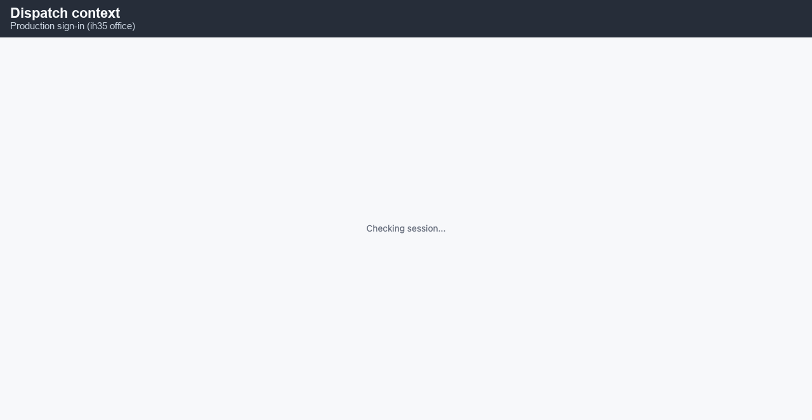
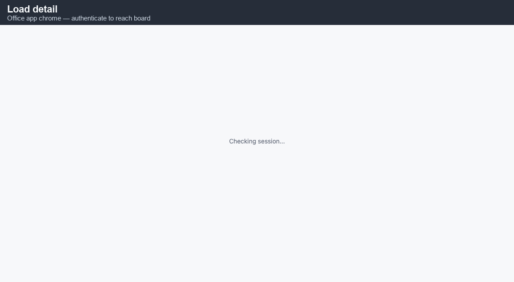
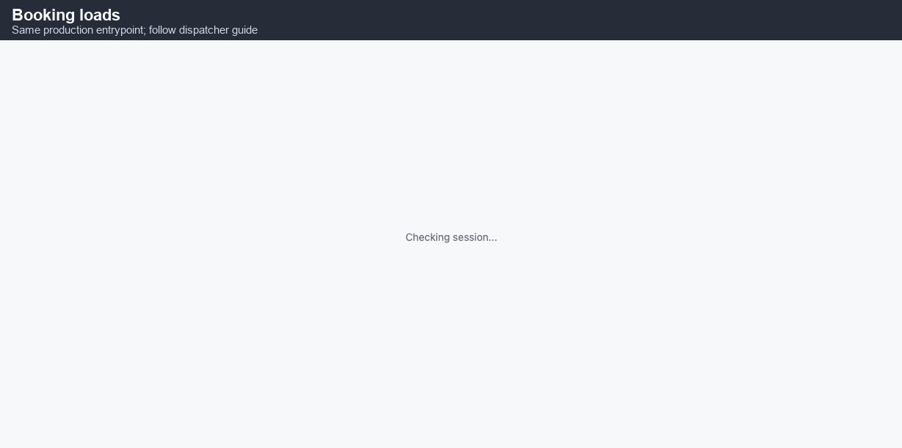
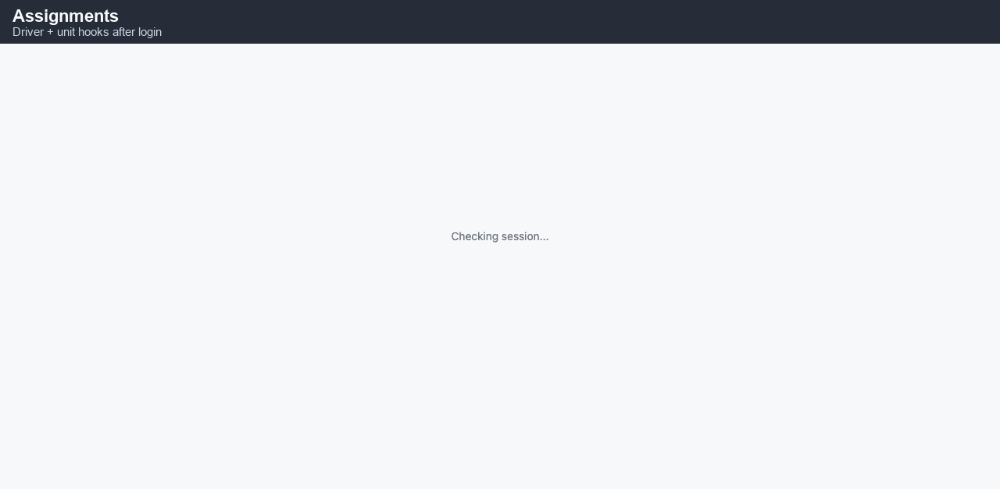
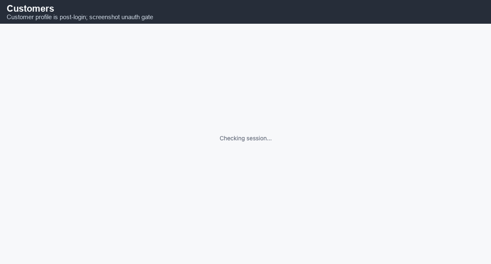
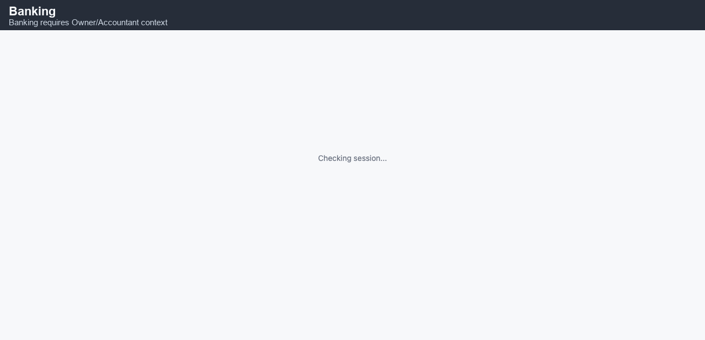
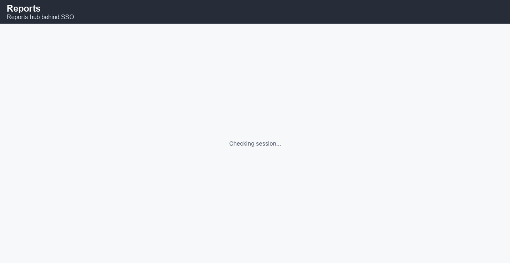
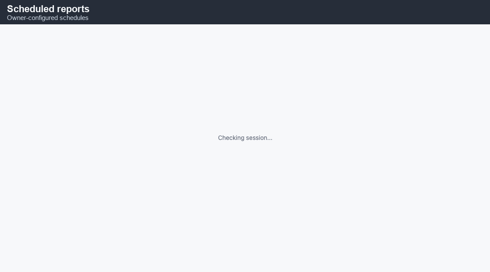

# Dispatcher quickstart — IH35 Office

**You’ll learn**

- How to **sign in** (Google) and choose the correct **operating company**.
- How to read the **dispatch board** and open **load detail** safely.
- How to **book / plan** loads and assign **driver + power unit**.
- Where **customer** and **driver finance** records fit in day-to-day triage.
- How **reports** and **scheduled emails** surface bottlenecks.
- What to check when loads **disappear**, **permissions error**, or **sync** looks stale.

Audience: **Dispatchers**, **fleet managers**, and **ops leads** using the office app at **https://app.ih35dispatch.com**.

---

## 1. Sign in and company context

1. Browse to **https://app.ih35dispatch.com/login**.
2. Click **Sign in with Google** (company-enforced Workspace / Gmail).
3. After redirect, confirm the **company selector** (TRK vs TRANSP vs other) matches the freight you are moving today.

**Why this matters:** Most list queries are **scoped by operating company**. Picking the wrong org makes loads “vanish.” If you truly work across orgs, switch explicitly—never assume a global “all companies” view unless your Owner enabled it.

**Troubleshooting**

- **Redirect loop / 403:** Cookies blocked, wrong OAuth client, or user missing in `identity.users`. Escalate to Owner with your **email** + expected **role** (`Dispatcher` vs `Manager`).
- **Read-only everywhere:** Role may be `Driver` on accident—owner must correct role and re-login.

---

## 2. Dispatch board mental model

The **dispatch board** is your air-traffic screen: cards or rows represent **loads** in statuses like **assigned**, **dispatched**, **at pickup**, **in transit**, **at delivery**.

**Daily flow**

1. Scan **late risk** (color chips / flags if configured).
2. Confirm **drivers on-duty** vs loads needing assignment.
3. Drill into exceptions (missing tractor, missing POD path, border paperwork).

**Keyboard / speed tips**

- Keep a **filtered bookmark** (e.g., “Today + USMCA lane”) if the UI supports saved filters in your build.
- Teach drivers **consistent status hygiene**—your board is only as accurate as arrivals/departs in the field app.

---

## 3. Load detail — the source of truth

Click any load to open **detail**. You should see:

- **Customer** + billing clues (for AR follow-up, not for illegal sharing externally).
- **Rate / miles** summary (read-only vs editable depends on role).
- **Assignments** (primary/secondary driver, unit, trailer linkage when modeled).
- **Stops** timeline (pickup/delivery sequence).

**Before you change assignments**

- Confirm **driver PTO / ELD availability** with your operations policy.
- If the unit swap affects **IFTA** or **permit book**, note it in **load notes** for accounting.

---

## 4. Booking a new load (happy path)

Exact clicks vary by template features, but the archetype is:

1. Start **New load** (or **Book from template** if your lane is standardized).
2. Pick **customer** (search by code or name).
3. Enter **pickup / delivery** windows, commodity basics, and **rate**.
4. Add **stops** in order; verify **time zones** on border runs.
5. Save as **planned** / **booked** per workflow.

**Quality gates**

- **Duplicate load numbers:** The system enforces per-company uniqueness—if you collide, append a suffix only if your SOP allows.
- **Customer credit hold:** If AR flagged the account, do not dispatch without Owner override.

---

## 5. Assigning driver + unit

From load detail → **Assignments** (wording may be **Dispatch** or **Fleet**):

1. Choose **primary driver** (must exist and be active).
2. Attach **tractor** (`mdata.units`) and **trailer** (`mdata.equipment`) when your process separates them.
3. Move status to **dispatched** when the driver acknowledges (field app or verbal per SOP).

Communicate **macro context**—drivers should never discover hazmat level or seal instructions for the first time *after* accepting.

---

## 6. Customer lookup (AR-sensitive)

Open **Customers → search** to view profile tabs:

- **Contacts** for appointments.
- **Billing & receivables** for factoring clues and pay terms (read-only for most dispatchers).

**Do not** screenshot customer tax IDs into unsecured chat tools.

---

## 7. Driver finance entry points

Dispatchers rarely **approve** settlements, but you **triage evidence**:

- Navigate **Driver finance → Settlements** to see stuck states.
- Confirm **POD attachments** arrived from the field before nagging accounting.

If you adjust miles in the field without recording it in IH35, settlements will not magically fix themselves—update the **system of record** first.

---

## 8. Banking awareness (read-mostly)

You may peek at **Banking → Home** when reconciling “did customer wire land?” questions.

Only **Accountant / Owner** should categorize transactions or trigger QBO pushes; your job is to **flag timing** mismatch (“load delivered Tue, customer says paid Wed”).

---

## 9. Reports hub

The **Reports** area aggregates operational KPIs (exact tiles depend on entitlements).

Typical dispatcher uses:

- **Lane / utilization** views to argue for repositioning deadhead.
- **Service failure** / **late** dashboards to coach drivers without anecdotal bias.

---

## 10. Scheduled report emails (visibility only)

Owners configure **Scheduled reports**; dispatchers benefit from PDFs landing in inbox.

If your morning PDF is missing:

- Check spam.
- Ask Owner whether the schedule is **paused** after an incident.
- Confirm **recipients_to** includes your work email, not a personal alias you do not monitor.

---

## Troubleshooting playbook

| Symptom | Likely cause | First action |
| --- | --- | --- |
| Board empty | Wrong company selected, or aggressive status filter | Reset filters; re-pick org |
| Cannot save load | Validation (missing customer, zero miles) | Read inline error |
| Driver cannot see load | Not assigned primary/secondary, or driver app logged into wrong email | Cross-check assignments + identity link |
| QBO invoice delay | Outbox / sync worker backlog | Notify Accountant; do not duplicate AR in spreadsheets |

**Escalation**

- **Accounting:** pay terms, invoice PDF correctness.
- **Owner / Admin:** role grants, OAuth failures, bank feeds.
- **Safety:** hours violations surfaced on integration (if enabled).

---

## Habits that keep the TMS trustworthy

1. **Note everything customer-facing** in load notes—even a 2-minute delay reason prevents invoice disputes.
2. **Timestamp communications:** “Called shipper 14:05 CT—lumper required” beats “called shipper.”
3. **Close loops:** If you reassign a load, **ping the old driver** so they do not deadhead to the wrong pickup.
4. **Protect PII:** Customer lists are competitive advantage—treat exports like cash.

## Border, temperature, and special commodities (dispatcher addendum)

**USMCA / border moves:** Ensure stops include **country** fields and customs references when modeled. If the UI exposes **border crossing** stop types, insert them **between** domestic legs so driver sequencing matches physical inspections.

**Reefers:** Confirm **temperature set-point instructions** appear in notes or structured fields. If IH35 tracks **repetitive failure** alerts (varies by build), treat a flashing icon as **food-safety adjacent**—call maintenance before loading.

**Hazmat:** Never rely on driver memory. If placards are required, verify **permit pack** attachment URLs (where your org stores them) and mark the dispatcher of record in notes for audits.

## After-hours and handoff discipline

Night shifts fail when information lives in **personal text threads** instead of IH35.

- End each shift with a **3-bullet handoff note** on any open load ID (even if status is green).
- If you voice assign a load, **confirm in TMS within 15 minutes** so accounting sees the same truth drivers do.
- For weather holds, mark **planned pause** explicitly; do not leave loads dangling in `dispatched` if tractors are parked.

## Coaching drivers without burning trust

Use TMS facts—**arrival timestamps**, **upload timestamps**, **deadhead miles**—when discussing performance. Vague criticism (“you’re always late”) without data erodes morale; specific feedback (“three late arrivals tied to fuel stop length”) enables change.

## When to involve safety vs discipline

- **Safety** first for HOS uncertainty, crash-adjacent events, or repeated mobile usage while moving (if telematics integrates later).
- **HR / Owner** for insubordination patterns **after** you document objective TMS evidence.

## Templates, lanes, and repeat customers

Many IH35 fleets run **dense lanes** (e.g., weekly milk runs). Where **load templates** exist:

- Clone last week’s skeleton, then adjust **appointments** only—this saves 20+ fields of typing and reduces typo risk on addresses.
- Keep **lane notes** (“lumper on inbound only”) in the template so rookies inherit wisdom.
- Periodically **audit templates** quarterly; fuel surcharges and appointment policies drift.

For **seasonal spikes** (produce, retail peak), pre-create **placeholder planned loads** only if your governance allows—stale planned loads pollute forecasting if left orphaned.

## Capacity planning without a crystal ball

You do not need perfect forecasts—just **explicit assumptions**:

1. List **tractors truly usable** (subtract shop hours).
2. List **drivers available** minus PTO / training.
3. Compare to **booked + high-probability tender** loads for the horizon you manage (24h vs 72h).
4. Flag **overage early** to sales so they do not promise impossible service.

IH35 reports (§9) help, but a **whiteboard reality check** still catches “phantom capacity” when someone forgets to mark a unit OOS.

## Communications hygiene with customers

Customers forgive delays they **expect**; they litigate delays that **surprise** them.

- Proactive SMS/email templates should mirror what you type in **load notes**—single source of truth prevents “dispatch told me X but accounting heard Y.”
- If a customer portal or tracking link exists in your future roadmap, treat today’s disciplined notes as training data for automation.

## Metrics dispatchers actually control

You cannot single-handedly fix **global market rates**, but you **can** move levers IH35 measures:

- **First dispatch time** after booking (process metric).
- **Percent of loads with same-day POD upload** (cash conversion).
- **Deadhead percentage by lane** (network design input for Owners).

Pick **one metric per quarter** to improve as a team so dashboards don’t become wallpaper.

## Working with accounting without hostility

Accounting lives in **accrual / invoice** time; dispatch lives in **appointment** time. Translation table:

| Dispatch says | Accounting hears |
| --- | --- |
| “Delivered Friday 21:00” | “Invoice Monday earliest unless factoring batch ready” |
| “Detention likely” | “Need timestamped notes before AR emails customer” |

Bring **IH35 artifacts** (note timestamps, POD paths) to every cross-department meeting—screenshots with blurred rates still help.

## Incident response on “system slow” days

When **everyone** complains simultaneously:

1. Confirm **internet health** (ISP outage vs app-only).
2. Check **status page / owner Slack** for deploy notices.
3. Stop **large bulk imports** or integrations someone kicked off accidentally.
4. Switch to **voice coordination** with explicit load IDs until latency normalizes—do not trust stale boards for safety-critical reassignment.

Document the window afterward so engineering can correlate logs.

## Dispatcher glossary

- **Booked vs dispatched:** Booked = commercial commitment to move; dispatched = driver notified / rolling.
- **Soft delete:** Load hidden from default board but retained for audits—do not assume “gone means never existed.”
- **Primary vs secondary driver:** Team operation pattern; settlement attribution follows company policy, not UI labels alone.
- **Stop sequence:** Ordered geography; skipping breaks geofence logic in the field app.
- **Outbox (accounting):** Async queue pushing financial records to QuickBooks—delay here is **not** the same as TMS delay.

## New-hire dispatcher onboarding (week 1)

**Day 1–2:** Shadow boards without touching assignments—learn **status vocabulary** and customer personalities.

**Day 3–4:** Own **low-risk moves** (empty repo, dedicated customer) with mentor review before save.

**Day 5:** Present **three learnings** in standup (UI friction, unclear customer rule, documentation gap)—this accelerates org learning faster than silent struggle.

---

_Last updated: 2026-05-14_
