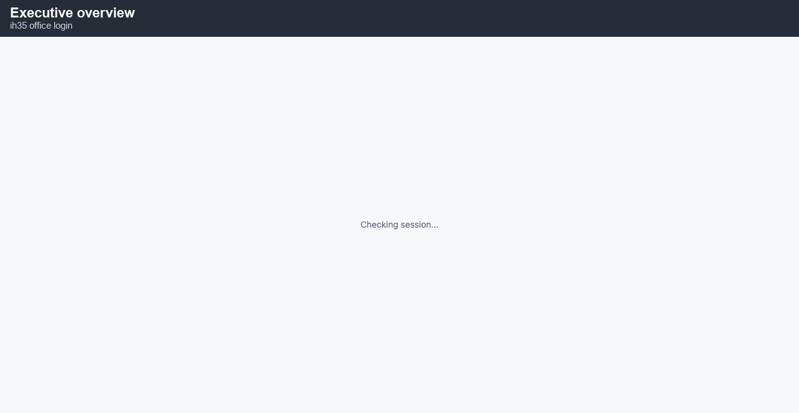
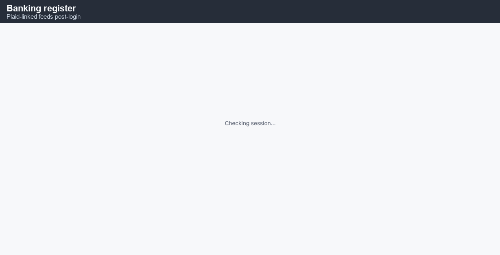
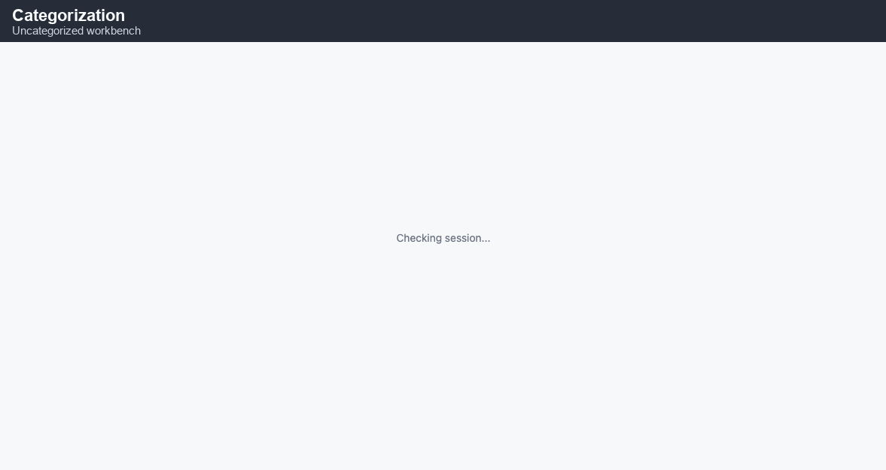
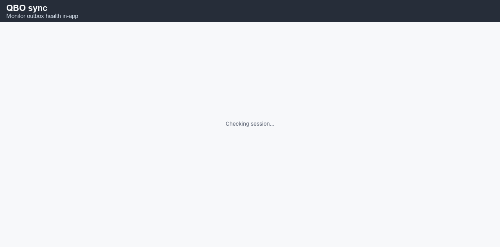
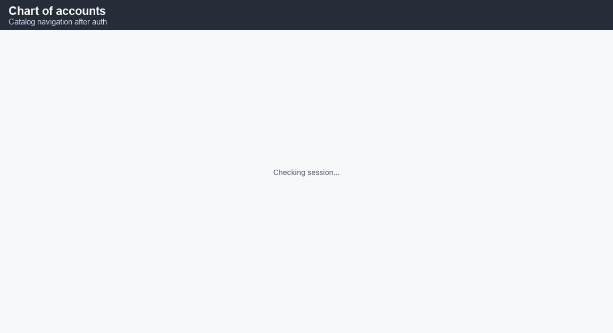
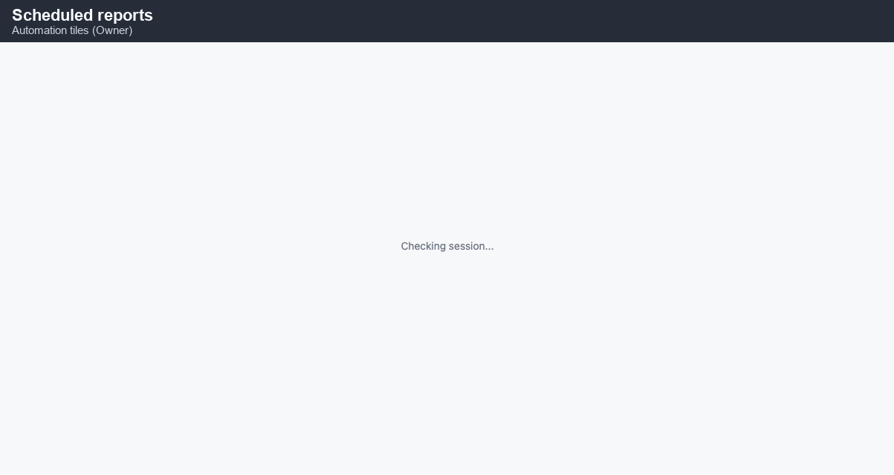
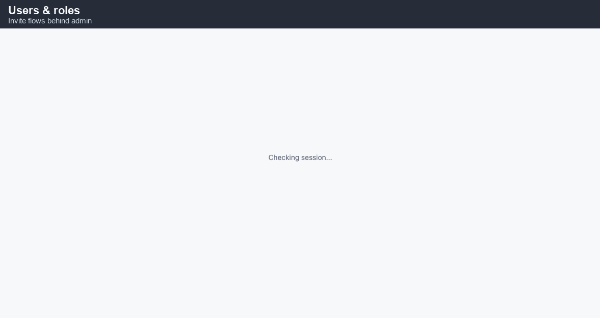

# Owner / administrator quickstart — IH35 Office

**You’ll learn**

- How **Owner** responsibilities differ from **Dispatcher** (governance vs throughput).
- How to monitor **banking**, **uncategorized transactions**, and **Plaid health**.
- How **QuickBars Online sync** and **outbox** concepts affect financial truth.
- How to configure **scheduled reports** and validate recipients.
- How to manage **users / roles** safely (last Owner rule).
- Where **audit** and **compliance** hooks live for post-MVP maturity.

Audience: **Owners**, **Administrators**, **Accountants** at **https://app.ih35dispatch.com**.

---

## 1. Governance-first mindset

Owners optimize **survival and compliance**, not just trucks moving.

1. **Cash visibility** beats optimistic dispatch boards—know which customers actually pay.
2. **Role hygiene** beats hero passwords—no shared Owner logins.
3. **Integration health** (Plaid, QBO) is as critical as uptime—silent drift creates tax risk.

Your first daily tab might still be **Dispatch**, but your **second** tab should be **Banking** or **Accounting** sync status.

---

## 2. Operating company isolation

IH35 is multi-tenant at the **operating company** grain. Owners toggling org context must understand:

- **Assets** and **drivers** may be shared or leased across legal entities per your corporate structure.
- Certain **bank accounts** map 1:1 to an operating company for RLS.
- Mis-selection during admin tasks causes “missing data” support tickets—train accountants to verbalize **which org** before pasting UUIDs into chat.

---

## 3. Banking: registers and feeds

Navigate **Banking → Home / Register** to see linked **Plaid** accounts.

**Daily checks**

- Any account in **needs_reauth**? Fix before month-end.
- **Balance jumps** without loads? Investigate fraud or payroll pulls before categorization.

Use **Categorize / Uncategorized** views to **apply GL**, **mark transfers**, or route to **manual journal entries**—this is where operating reality meets the ledger.

---

## 4. QuickBooks Online (QBO) sync posture

Open **Accounting → QBO sync status** (exact nav label may vary by build).

**Healthy pattern**

- Outbox **depth near zero** most days.
- Failures are **actionable** (token, mapping), not mysterious 500s.

**Unhealthy pattern**

- Staff re-key invoices in QBO “temporarily”—that temporary becomes permanent shadow accounting.

Chart of accounts cleanliness matters before MVP cutover:

---

## 5. Scheduled reports (email automation)

Owners (or delegated admins) configure **Scheduled reports** so field leaders get **predictable PDF/XLSX/CSV** in inbox.

**Guardrails**

- Use **distribution lists** with staffing redundancy—never one human on `recipients_to`.
- **Pause** schedules during known bad deploy windows; resume after smoke passes.
- Validate **timezone** (`America/Chicago` default) vs freight that sleeps in El Paso vs Detroit.

---

## 6. User administration & roles

Navigate **Users** (or **Settings → Users**) to invite or deactivate identities.

**Invariant:** You cannot deactivate the **last active Owner**—the database blocks it. Plan **two Owners** minimum for succession.

**Preferred language:** Newer schemas require `preferred_language` (`en`/`es`)—ensure HR onboarding collects it so verification scripts pass.

---

## 7. Audit & oversight (lightweight)

Not every org enables full audit viewers day one, but Owners should know **where breadcrumbs are**.

When you hear “someone changed rate,” your path is:

1. Identify **load ID** / **invoice ID**.
2. Pull **who** (user uuid) and **when** from audit surfaces (exact UX evolves).
3. Pair with **human conversation** before accusation—fat finger vs malice differs in response.

---

## 8. Incident leadership (finance-critical)

When payments stop flowing:

1. **Pause spend** that depends on stale cash picture (equipment buys) until bank feed health returns.
2. **Notify factoring partner** if wires depend on invoice timing you can no longer prove.
3. **Document timeline** for insurer / lender if covenant reporting is impacted.

Speed of honest communication beats polished silence.

---

## 9. Vendor & customer strategic leverage

Use **strategic vendor** records (factoring, fuel cards, insurance) as first-class—do not bury only in spreadsheets.

- Annual true-ups belong as **calendar reminders** linked to vendor notes.
- Customer concentration risk: if top-2 customers exceed internal threshold, Owners should insist dispatch sees **credit flags** early.

---

## 10. Pre-MVP checklist (Owner sign-off)

- [ ] Two+ active Owners in `identity.users`.
- [ ] Plaid production keys on Render for every live bank account.
- [ ] QBO mapping reviewed by Accountant.
- [ ] Scheduled reports smoke-tested to internal inboxes.
- [ ] DR runbook acknowledged (`docs/dr-runbook.md`).
- [ ] Seed CSV templates prepared (`tests/fixtures/production-seed/`).

---

## Troubleshooting table

| Risk signal | Interpretation | Mitigation |
| --- | --- | --- |
| Outbox depth increasing | QBO mapping/token | Roll credentials, pause heavy imports |
| Bank categorization backlog | Staff bandwidth | Temporary contractor + training |
| Role sprawl | Everyone Admin | Re-map least privilege |
| Drivers bypass app | Culture | leadership + measured consequences |

## Cash application and AR discipline

Modern TMS bridges **bank deposits** to **open invoices** via **cash application** screens (customer billing tabs). Owners should verify:

- Unapplied cash does not sit orphan unless it truly is **customer credit** intentional.
- Write-offs require **dual control** (maker/checker) if your policy demands it—even if software allows solo click.

Training accountants to **speak in cents internally** reduces rounding arguments with engineering logs.

## Payroll + driver settlements: governance

Even when settlements are semi-automated:

- Publish **cutoff times** (e.g., “Tuesday 17:00 CT for Friday pay file”).
- Keep a **retro policy** for corrections—unbounded reversals erode trust.

If Owner also acts as **dispatcher**, separate **mental hats**: payroll panic should not cause unsafe dispatch shortcuts.

## Insurance, claims, and documentation chain

Accidents generate **subrogation** requests weeks later. Your rule: **POD + notes + photos** remain reachable for **7 years** per counsel (adjust per jurisdiction).

Owners audit quarterly:

- Random sample **10 loads** for artifact completeness.
- Compare **maintenance work orders** linkage if safety module active—unrelated, but cultural signal.

## Lender / covenant reporting

If a lender asks for **trailing twelve metrics**, define **one reporting timezone** and **one revenue recognition rule** (accrual vs cash). IH35 can export data, but **interpretation** remains accounting’s job—Owners sponsor clarity meetings until numbers stop wiggling.

## Vendor negotiation tied to TMS hygiene

Fuel discounters and maintenance networks give better pricing when **usage data** is auditable. Clean **vendor codes**, **unit assignment**, and **expense attribution** turn into leverage at renewal—messy data turns into “trust us” spreadsheets lenders dislike.

## Security minimums beyond passwords

- Enforce **Google Workspace SSO** where possible; ban password vault sharing in chat.
- Rotate **Plaid secrets** on vendor churn (driver turnover is unrelated but secrets hygiene isn’t).
- Review **Render env var** access quarterly—contractors get time-boxed invites, not standing broad admin if avoidable.

## What NOT to do as Owner (even if you can)

- Do not silently **categorize** personal expenses through business bank feeds—creates tax & fiduciary issues.
- Do not **deactivate audit-capable roles** to silence disagreement—fix the process instead.
- Do not promise customers **real-time QBO** if outbox latency exists; set **SLA verbally** aligned with engineering reality.

## Succession planning (brief)

Document in your password manager **where** (not the values) API keys live: Neon, Render, Plaid, R2, email DNS. IH35 code can be perfect yet org-impaired if only one human can touch infra.

## Quarterly business review (Owner cadence)

Use IH35 exports to anchor a **2-hour QBR** minimally covering:

1. **Revenue by customer concentration** (top-10 pie).
2. **Deadhead / paid miles trend** if available.
3. **DSO proxy** (days from delivery → invoice → cash) even if imperfect early.
4. **Open maintenance spend** vs budget (if maintenance module live).
5. **Incident log** (severity, resolution time)—culture signal.

If metrics disagree between **TMS** and **QBO**, freeze storytelling until reconciliation completes—narrating fiction wastes the room’s IQ.

## Technology roadmap realism

Owners love moonshots; engineers love stability. Balance with a **three-horizon** model:

- **H0 (now):** MVP reliability, bank + payroll correctness.
- **H1 (90d):** automation that removes duplicate data entry (scheduled reports + categorization rules).
- **H2 (6–12m):** customer portals, predictive maintenance—only after H0 green for 30 consecutive days.

Say **no** to feature requests that bypass RLS or audit—shortcuts compound.

## Working with external accountants

Provide **read-only** synthetic exports first when possible; broaden access only under NDA refresh.

Clarify **cutover timing** for tax year—mid-year COA reshuffles confuse book vs tax depreciation schedules.

## Customer bankruptcy early warning

TMS lists + AR aging highlight **slow pay**. Owners should define **tripwires**:

- **>15 days** late twice → credit review.
- **>30 days** → hold dispatch expansion for that customer unless COD arranged.
- **Bankruptcy filing** rumor → preserve documentation chain; legal—not dispatch—owns comms.

Software cannot replace **credit instinct**, but it prevents “we didn’t see it coming” excuses.

## Ethics & harassment hooks

Owners set **tone**: Safety and HR modules (when enabled) only work if leaders model reporting non-retaliation. Document **how** drivers escalate beyond dispatch (anonymous channel if appropriate).

## Physical disaster contingencies

If HQ loses power:

- Confirm **cellular hotspots** exist for minimal finance continuity.
- Know **where** PDF invoices live if email downtime stretches (cached exports).
- Practice **Neon branch restore** once in staging (`docs/dr-runbook.md`) so panic day is rehearsal #2 not #1.

## When to hire fractional CFO vs full-time controller

Signals for **fractional**:

- Revenue < $20M but complexity rising (multi-entity, factoring, cross-border).
- You spend >10 Owner hours/week on_GL hygiene.

Signals for **full-time**:

- Lender covenants monthly + integration depth demands daily outbox babysitting.

IH35 reduces clerical drag but not **judgment**.

## Data room readiness (M&A or refinancing)

Even if you are not selling, behave **as if**:

- Charts of accounts **map cleanly** to industry standard buckets.
- Revenue **disputes** have documented resolution history.
- Owner draws vs retained earnings are **explicit**.

Buyers discount messy TMS exports heavily—orderly IH35 usage is a **balance sheet accelerant**.

## Internal communication rhythm

- **Weekly 15m finance + dispatch sync** (structured agenda).
- **Monthly owner deep dive** on exceptions > threshold dollars.
- **Quarterly external advisor** (legal/tax) review of new workflows enabled by IH35.

Rhythm beats heroics.

## Glossary (Owner / Admin)

- **RLS:** Row-level security—database enforcement that users only touch permitted org rows.
- **Operating company:** Tenant slice for P&L and cash usually aligned to a legal motor carrier entity.
- **Asset holder vs carrier:** Org types describing who owns title vs who runs freight (per your corporate setup).
- **Outbox:** Reliable async sender pattern for QBO pushes—think durable queue, not instant magic.
- **PITR:** Point-in-time database recovery; insurance against bad migrations.

Precision of vocabulary prevents 30-minute meetings arguing past each other.

## Scenario playbook — “We doubled fleet size in 6 months”

1. **Freeze vanity metrics**; watch **cash conversion cycle** first.
2. **Hire middle-office** before ninth dispatcher—otherwise Owners become accidental data clerks.
3. **Segment customers**—high-growth without customer tiering invites unprofitable freight.
4. **Re-audit integrations weekly** until stable—Plaid + QBO dislike bursty transaction volume without categorization capacity.

Surviving scale is mostly **constraint management**, not motivational posters.

---

_Last updated: 2026-05-14_
